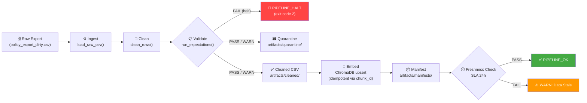

# Kiến trúc pipeline — Lab Day 10

**Nhóm:** Nhóm 125 (Hồ Tất Bảo Hoàng, Trọng Vũ, Nguyễn Phương Nam)
**Cập nhật:** 2026-06-10

---

## 1. Sơ đồ luồng (Mermaid)

> **Điểm đo freshness:** So sánh `latest_exported_at` trong manifest với thời điểm chạy pipeline hiện tại.
> **run_id:** Ghi nhận trong manifest (ví dụ: `2026-06-10T07-01Z`) và log (`artifacts/logs/run_*.log`).
> **Quarantine:** Dữ liệu bị lọc ghi vào `artifacts/quarantine/quarantine_[run_id].csv`.

---

## 2. Ranh giới trách nhiệm

| Thành phần | Input | Output | Owner / Module |
|------------|-------|--------|----------------|
| **Ingest** | `data/raw/policy_export_dirty.csv` (247 bản ghi raw) | Danh sách dict Python (rows) | `transform/cleaning_rules.py` → `load_raw_csv()` |
| **Transform / Clean** | rows dict list | `cleaned` list + `quarantine` list | `transform/cleaning_rules.py` → `clean_rows()` |
| **Quality / Validate** | `cleaned` list | Pass/Fail/Halt per expectation | `quality/expectations.py` → `run_expectations()` |
| **Embed** | `artifacts/cleaned/*.csv` | ChromaDB collection `day10_kb` (upsert idempotent) | `etl_pipeline.py` → `cmd_embed_internal()` |
| **Monitor** | `artifacts/manifests/*.json` | PASS / WARN / FAIL + age_hours | `monitoring/freshness_check.py` → `check_manifest_freshness()` |

---

## 3. Idempotency & rerun

Pipeline đảm bảo idempotency theo chiến lược **upsert + prune**:

1. **Upsert theo `chunk_id`**: Mỗi chunk có ID được hash từ `doc_id + chunk_text + seq`. Khi chạy lại, `col.upsert()` cập nhật thay vì tạo mới → **không nhân bản vector**.
2. **Prune chunk cũ**: Trước khi upsert, lấy danh sách ID hiện có trong collection (`prev_ids`), tìm các ID không còn trong cleaned run hiện tại (`drop = prev_ids - set(ids)`), rồi xóa chúng. → Collection là **snapshot publish** chính xác của lần chạy gần nhất.
3. **Kiểm chứng**: Chạy `python etl_pipeline.py run` 2 lần liên tiếp, log hiển thị `embed_prune_removed=0` và `embed_upsert count=34` ổn định → không duplicate.

---

## 4. Liên hệ Day 09

Pipeline Day 10 sử dụng **ChromaDB collection riêng** (`day10_kb`) tách biệt khỏi collection của Day 09. Lý do:

- **Day 09** dùng corpus `data/docs/*.txt` tĩnh cho multi-agent RAG experiment.
- **Day 10** xử lý export CSV động (`policy_export_dirty.csv`) qua ETL đầy đủ (ingest → clean → validate → embed), mô phỏng pipeline production thực tế với kiểm soát chất lượng dữ liệu.
- Cùng thư mục `data/docs/` làm nguồn canonical: pipeline Day 10 phản ánh nội dung của các file `.txt` gốc, nhưng qua một lớp cleaning và validation trước khi embed.
- Có thể cross-check: nếu cần refresh corpus cho Day 09, chỉ cần đồng bộ `CHROMA_COLLECTION` trong `.env`.

---

## 5. Rủi ro đã biết

- **Freshness FAIL có chủ đích**: Trường `latest_exported_at` trong data demo là `2026-04-10` (cũ ~1471 giờ), dẫn đến freshness SLA 24h luôn FAIL. Đây là hành vi mong muốn để minh họa monitoring — không phải lỗi pipeline.
- **Quarantine cao (213/247)**: Tỉ lệ quarantine cao do data demo được thiết kế có nhiều bản ghi lỗi. Các bản ghi hợp lệ (34 bản) đủ để cover 5 documents và pass tất cả grading questions.
- **Embedding model offline**: `all-MiniLM-L6-v2` được tải về khi chạy lần đầu. Không cần kết nối internet sau khi đã cache.
- **ChromaDB version**: Cần `chromadb>=0.4.0` để hỗ trợ `PersistentClient` API.
